# 🔗 Combined System — Overall Workflow
### Smart India Hackathon (SIH) 2026 | QuantumSIHCracker | All Teams

> **GitHub Organization**: `https://github.com/QuantumSIHCracker`
> **Combined Repo**: `https://github.com/QuantumSIHCracker/sih-combined-system`
> **Workflow Folder**: `/home/arpit_ubuntu/New WorkFlow/SIH-Quantum-Cracker/`
> **Last Updated**: 2026-09-14

---

## 🗂️ Repositories

| Repository | Team | Purpose |
|---|---|---|
| `sih-hardware-firmware` | Hardware | ESP32-S3 Arduino firmware, INMP441 integration, on-device KWS |
| `sih-ml-models` | ML | KWS model training, MFCC pipeline, INT8 TFLite quantization |
| `sih-server-backend` | Server | FastAPI server, Silero VAD, Faster-Whisper, SSE dashboard |
| `sih-combined-system` | All | Integration docs, protocol spec, workflow plans |

---

## 🏗️ Full System Architecture

```mermaid
flowchart LR
    subgraph Edge["ESP32-S3 Edge Device (Hardware Team)"]
        MIC["INMP441 MEMS Mic\n(I2S, 16kHz, 24-bit)"] --> DMA["Core 0: I2S DMA"]
        DMA --> DCF["DC High-Pass Filter\n(40Hz IIR)"]
        DCF --> GAIN["Gain Scale >>11\n→ int16"]
        GAIN --> RING["True FIFO Ring Buffer\n(3s / 48000 samples)"]
        RING --> GATE["Acoustic Energy Gate\n(peak threshold)"]
        GATE --> KWS["TENet KWS INT8 TFLite\n(on-device AI)"]
        KWS -- "Wake Word: Ankit" --> TRIG["Trigger Queue"]
        TRIG --> STREAM["Core 1: Stream Manager"]
        RING --> STREAM
        STREAM --> LED["WS2812 RGB LED\n(GPIO 48)"]
    end

    subgraph Transport["Dual Transport"]
        STREAM -- "USB Serial 921600 baud\n[0xAA][0x55][len_hi][len_lo][PCM...]" --> SRV
        STREAM -. "Wi-Fi WebSocket\nws://ip:8080/stream" .-> SRV
    end

    subgraph Server["FastAPI Server (Server Team)"]
        SRV["Serial / WebSocket\nIngestion Engine"] --> VAD["Silero VAD ONNX\n(1.2s silence = end)"]
        VAD --> ASR["Faster-Whisper base.en\n(INT8, CPU)"]
        ASR --> KWS2["Server KWS Verify\n(regex: Ankit)"]
        KWS2 --> CMD["Command Dispatch\n(future scope)"]
        SRV --> SSE["SSE Broadcast"]
    end

    subgraph Dashboard["Web Dashboard"]
        SSE --> UI["http://localhost:8080/dashboard\nLive Telemetry + Transcription"]
    end

    subgraph MLPipeline["ML Pipeline (ML Team)"]
        DS["Dataset\n16kHz WAV clips"] --> FE["MFCC Extraction\n(51×10, 512-pt FFT)"]
        FE --> TRAIN["Model Training\nTensorFlow/Keras"]
        TRAIN --> Q["INT8 Post-Training\nQuantization"]
        Q --> TF["model.tflite\n(< 60KB)"]
        TF -- "C header array\nkws_model_data.h" --> KWS
    end
```



---

## 📋 Communication Protocol Specification

> ⚠️ **THIS IS THE CONTRACT. ALL TEAMS MUST FOLLOW THIS EXACTLY.**
> Any change requires a GitHub issue tagged `protocol-change` + agreement from ALL teams first.

### Binary Audio Packet — Hardware → Server

```
┌────────┬────────┬─────────────┬─────────────┬──────────────────────────┐
│  0xAA  │  0x55  │   len_hi    │   len_lo    │  PCM data (int16_t LE)   │
│ 1 byte │ 1 byte │   1 byte    │   1 byte    │      len bytes           │
└────────┴────────┴─────────────┴─────────────┴──────────────────────────┘
```

- `len = (len_hi << 8) | len_lo` = number of PCM bytes following
- Valid range: `4 ≤ len ≤ 2048`
- PCM format: 16kHz, int16_t, mono, little-endian
- Typical chunk: 512 samples = 1024 bytes

### JSON Control Events (text, newline-terminated on serial)

| Direction | Event | Meaning |
|---|---|---|
| HW → Server | `{"event":"start"}` | Wake word detected, begin session |
| HW → Server | `{"event":"telemetry","free_heap":N,"cpu_percent":N,"mic_peak":N,"uptime_ms":N}` | Every 3 seconds |
| Server → HW | `{"event":"stop"}` | End of speech detected, stop streaming |

### Audio Format — Non-Negotiable

| Property | Value |
|---|---|
| Sample Rate | **16,000 Hz** |
| Bit Depth | **16-bit signed** (int16_t) |
| Channels | **Mono (1)** |
| Endianness | **Little-endian** |
| Serial baud | **921,600** |
| WebSocket port | **8080** |

### KWS Model Interface — ML → Hardware

| Property | Value |
|---|---|
| Input tensor shape | `[1, 51, 1, 10]` INT8 |
| Output tensor shape | `[1, 5]` INT8 |
| Wake word class index | `0` |
| Wake threshold | INT8 score ≥ 0 (≥ 50%) |
| MFCC FFT size | 512 points |
| MFCC hop length | 320 samples (20ms) |
| MFCC mel bins | 10 |
| Frames per window | 51 (1 second at 16kHz) |
| Voice band | 300–8000 Hz |

---

## 🌿 Git Branching Strategy (All Repos)

```
main          ← Stable releases only. PR + review required. Never push directly.
  └── dev     ← Integration. PR from feature branches.
        ├── feature/<name>       Hardware: firmware features
        ├── experiments/<name>   ML: model experiments
        └── feature/<name>       Server: backend features
```

### Rules
1. **Never push directly to `main`**
2. `feature/*` → `dev` : requires at least 1 review
3. `dev` → `main` : requires full integration test passing
4. Tag releases: `git tag -a v1.0 -m "SIH Demo v1.0"`
5. Commit messages follow: `type(scope): description`
   - `feat`, `fix`, `test`, `docs`, `perf`, `refactor`

---

## 📅 Project Timeline

### Week 1 — Setup & First Build
| Team | Goal |
|---|---|
| Hardware | Set up Arduino env, wire INMP441, get I2S audio working, confirm mic reads |
| ML | Set up Python env, implement MFCC pipeline, verify feature extraction |
| Server | Set up FastAPI project, implement serial listener + packet parser |

### Week 2 — Core Features
| Team | Goal |
|---|---|
| Hardware | Implement ring buffer, DC filter, energy gate, packet framing, USB serial streaming |
| ML | Collect/organize dataset, train first KWS model, INT8 quantize, deliver v0.1 tflite |
| Server | Implement Silero VAD, Faster-Whisper, session state machine, basic dashboard |

### Week 3 — Integration & Polish
| Team | Goal |
|---|---|
| All | End-to-end USB Serial integration test |
| Hardware | Integrate KWS model from ML team, test Wi-Fi WebSocket mode |
| ML | Improve model based on real hardware recordings |
| Server | Latency optimization, full dashboard, command dispatch |
| All | End-to-end Wi-Fi WebSocket integration test, demo prep |

---

## 🧪 Integration Testing Checklist

Run before every PR merge to `main` and before every demo:

- [ ] ESP32 firmware compiles without warnings or errors
- [ ] USB Serial mode: server connects, receives audio, produces transcript
- [ ] Wi-Fi WebSocket mode: connects, streams, transcribes
- [ ] Wake word "Ankit" detected reliably at 0.5m, 1m, 3m distance
- [ ] Speak 20 random sentences → ≤ 1 false trigger
- [ ] VAD finalizes within 2s of silence (no timeout hangs)
- [ ] Dashboard shows live CPU, RAM, mic peak data
- [ ] Server handles disconnect + reconnect gracefully
- [ ] Manual BOOT button trigger works
- [ ] LED: RED=idle, GREEN=voice detected, 4× RED flash=wake word

---

## 🚨 GitHub Issue Labels

| Label | When to use |
|---|---|
| `protocol-change` | Any change to packet format, audio format, events — ALL teams must approve |
| `model-update` | ML team has new tflite ready for hardware integration |
| `bug-critical` | Blocks demo — fix immediately |
| `integration` | Affects multiple teams |
| `ready-for-review` | PR is ready |

---

## 📞 Team Communication

| Channel | Purpose |
|---|---|
| Group chat | Daily standups (format: Done / Doing / Blocked) |
| GitHub Issues | Bugs, features, protocol changes |
| GitHub PRs | Code review |
| `combined/WORKFLOW.md` | **Source of truth for architecture and protocol** |

> ⚠️ If ANY team changes something that affects another team's interface, they MUST open a GitHub issue tagged `protocol-change` **before** making the change.
