# 🔗 Combined System — Overall Workflow
### Smart India Hackathon (SIH) 2026 | QuantumSIHCracker | All Teams

> **GitHub Organization**: `https://github.com/QuantumSIHCracker`
> **Combined Repo**: `https://github.com/QuantumSIHCracker/sih-combined-system`
> **Last Updated**: 2026-09-14

---

## 🗂️ Repository Structure

| Repository | Team | Purpose |
|---|---|---|
| `sih-hardware-firmware` | Hardware | ESP32-S3 Arduino firmware, circuit diagrams |
| `sih-ml-models` | ML | KWS model training, datasets, TFLite models |
| `sih-server-backend` | Server | FastAPI server, VAD, Whisper, dashboard |
| `sih-combined-system` | All | Integration testing, combined documentation, releases |

---

## 🏗️ Full System Architecture

```mermaid
flowchart LR
    subgraph Edge["ESP32-S3 Edge Device (Hardware Team)"]
        MIC["INMP441 MEMS Mic (I2S, 16kHz)"] --> DMA["Core 0: I2S DMA"]
        DMA --> DCF["DC High-Pass Filter (40Hz IIR)"]
        DCF --> GAIN["Gain Scaling (>>11)"]
        GAIN --> RING["True FIFO Ring Buffer (3s / 48000 samples)"]
        RING --> GATE["Acoustic Gatekeeper (Energy Gate)"]
        GATE --> KWS["TENet KWS INT8 TFLite (on-device AI)"]
        KWS -- "Wake: Ankit" --> TRIG["Trigger Queue"]
        TRIG --> STREAM["Core 1: Stream Manager"]
        RING --> STREAM
        STREAM --> LED["WS2812 RGB LED (GPIO 48)"]
    end

    subgraph Transport["Dual Transport"]
        STREAM -- "USB Serial\n921600 baud\n[0xAA][0x55][len_hi][len_lo][PCM...]" --> SRV
        STREAM -. "Wi-Fi WebSocket\nws://ip:8080/stream" .-> SRV
    end

    subgraph Server["FastAPI Server (Server Team)"]
        SRV["Serial/WebSocket Listener"] --> VAD["Silero VAD\n(1.2s silence = utterance end)"]
        VAD --> ASR["Faster-Whisper base.en\n(INT8, CPU)"]
        ASR --> KWS2["Server KWS Verify\n(regex: Ankit)"]
        KWS2 --> CMD["Command Dispatcher\n(future scope)"]
        SRV --> SSE["SSE Broadcast → Dashboard"]
    end

    subgraph Dashboard["Web Dashboard"]
        SSE --> UI["http://localhost:8080/dashboard\n(Live Telemetry + Transcription)"]
    end

    subgraph MLPipeline["ML Pipeline (ML Team)"]
        DS["Dataset (16kHz WAV)"] --> FE["MFCC Feature Extraction\n(51x10, 512-pt FFT)"]
        FE --> TRAIN["TENet Training\n(TensorFlow/Keras)"]
        TRAIN --> Q["INT8 Post-Training Quantization"]
        Q --> TF["model.tflite (< 60KB)"]
        TF -- "C header array" --> KWS
    end
```



---

## 📋 Communication Protocol Specification

> ⚠️ **THIS IS THE SACRED CONTRACT. ALL TEAMS MUST FOLLOW THIS EXACTLY.**
> Any change requires a GitHub issue + agreement from ALL teams before implementation.

### Binary Audio Packet (Hardware → Server)
```
┌────────┬────────┬─────────────┬─────────────┬──────────────────────────┐
│  0xAA  │  0x55  │   len_hi    │   len_lo    │  PCM data (int16_t LE)   │
│ 1 byte │ 1 byte │   1 byte    │   1 byte    │      len bytes           │
└────────┴────────┴─────────────┴─────────────┴──────────────────────────┘
```
- `len = (len_hi << 8) | len_lo` = number of bytes of PCM data
- Valid range: `4 ≤ len ≤ 2048`
- PCM: 16kHz, int16, mono, little-endian
- Typical chunk: 512 samples = 1024 bytes

### JSON Control Messages (Bidirectional, text, newline-terminated on Serial)

| Direction | Message | Trigger |
|---|---|---|
| HW → SVR | `{"event":"start"}` | Wake word detected on device |
| HW → SVR | `{"event":"telemetry","free_heap":N,"cpu_percent":N,"mic_peak":N,"uptime_ms":N}` | Every 3 seconds |
| SVR → HW | `{"event":"stop"}` | VAD detected silence / timeout |

### Audio Format Invariants
| Property | Value |
|---|---|
| Sample Rate | **16,000 Hz** (non-negotiable) |
| Bit Depth | **16-bit signed** (int16_t) |
| Channels | **1 (Mono)** |
| Endianness | **Little-endian** |
| Transport baudrate | **921,600** (USB Serial) |
| WebSocket port | **8080** |

### ML Model Interface (ML Team → Hardware Team)
| Property | Current Value |
|---|---|
| Input tensor shape | `[1, 51, 1, 10]` INT8 |
| Output tensor shape | `[1, 5]` INT8 |
| Wake word class index | `0` |
| Wake threshold | INT8 score ≥ 0 (≥50%) |
| MFCC: FFT size | 512 points |
| MFCC: Hop length | 320 samples (20ms) |
| MFCC: Mel bins | 10 |
| MFCC: Frames/window | 51 |
| Voice band | 300–8000 Hz |

---

## 🌿 Git Branching Strategy (All Repos)

```
main          ← Production-ready, tagged releases only. PR required. Tests must pass.
  └── dev     ← Integration branch. PR from feature branches here.
        ├── feature/<name>    (Hardware: firmware changes)
        ├── experiments/<n>   (ML: model experiments)
        └── feature/<name>    (Server: backend features)
```

### Merge Rules
1. **`feature/*` → `dev`**: Requires 1 review + tests passing
2. **`dev` → `main`**: Requires ALL teams to approve (or team lead) + full integration test passing
3. **NEVER** push directly to `main`
4. Tag releases: `git tag -a v1.0 -m "SIH Demo Build v1.0"`

---

## 📅 Project Timeline

### Week 1 (Setup & Baseline)
| Day | Hardware | ML | Server |
|---|---|---|---|
| 1-2 | Clone repos, verify firmware compiles | Clone repo, set up Python env | Clone repo, run server with existing firmware |
| 3-4 | Test USB Serial end-to-end pipeline | Extract dataset, run baseline model eval | Document API, start dashboard improvements |
| 5-7 | LED verification, telemetry check | Implement MFCC pipeline | Test WebSocket mode, add command handling |

### Week 2 (Integration & Enhancement)
| Day | Hardware | ML | Server |
|---|---|---|---|
| 1-3 | Integrate new model from ML team | Train improved model with augmentation | Latency optimization (target <3.5s E2E) |
| 4-5 | Wi-Fi WebSocket mode testing | INT8 quantization, size verification | REST API enhancement, session logging |
| 6-7 | Integration test with Server Team | Deliver model v1 to Hardware | Full pipeline integration test |

### Week 3 (Polish & Demo Prep)
| Day | All Teams | |
|---|---|---|
| 1-3 | End-to-end integration tests, bug fixes | |
| 4-5 | Demo rehearsal, hardware enclosure, stress testing | |
| 6-7 | Final tags, documentation freeze, README update | |

---

## 🧪 Integration Testing Checklist

### Before Each Demo / Release
- [ ] ESP32 firmware compiles without warnings
- [ ] USB Serial mode: `server.py` connects and transcribes correctly
- [ ] Wi-Fi WebSocket mode: connects, streams, transcribes
- [ ] Wake word "Ankit" detected at 1m distance, 3m distance
- [ ] False positive rate: speak 20 random sentences → ≤1 false trigger
- [ ] VAD correctly finalizes after silence (no 12s timeout)
- [ ] Dashboard shows live data (CPU, RAM, mic peak)
- [ ] Transcription history correct in dashboard
- [ ] Server handles ESP32 disconnect/reconnect gracefully
- [ ] Manual trigger button works
- [ ] LED colors correct: RED idle, GREEN speech, 4x RED wake

---

## 🚨 Escalation & Issue Tracking

### GitHub Labels (use in all repos)
| Label | Use |
|---|---|
| `protocol-change` | Any change to the communication protocol — ALL teams must approve |
| `model-update` | ML team has new model ready for Hardware integration |
| `bug-critical` | Blocks demo — fix immediately |
| `integration` | Affects multiple teams |
| `demo-ready` | Verified working for demo |

### Issue Templates (create in each repo)
```markdown
## Bug Report
**Team affected**: Hardware / ML / Server
**Severity**: Critical / High / Medium / Low
**Description**: 
**Steps to reproduce**: 
**Expected behavior**: 
**Protocol impact**: Yes / No (if Yes, tag protocol-change)
```

---

## 📞 Team Communication

| Channel | Purpose |
|---|---|
| Team group chat | Daily standups, quick questions |
| GitHub Issues | Bug reports, feature requests, protocol changes |
| GitHub PRs | Code review |
| This document | Source of truth for architecture and protocol |

### Daily Standup Format
```
[TEAM] Done: <what was completed>
       Doing: <current work>
       Blocked: <blockers, need help with>
```

---

## 📊 Performance Dashboard (Live Targets)

| Metric | Phase 1 Target | Final Target |
|---|---|---|
| Wake word detection accuracy | >85% | >95% |
| False positive rate (per 100 sentences) | <5 | <2 |
| E2E latency (wake word → transcript) | <6s | <3.5s |
| Whisper accuracy (WER) | <15% | <10% |
| ESP32 CPU idle load | <10% | <5% |
| ESP32 RAM usage | <256KB | <100KB |
| Server uptime | 95% | 99.9% |
