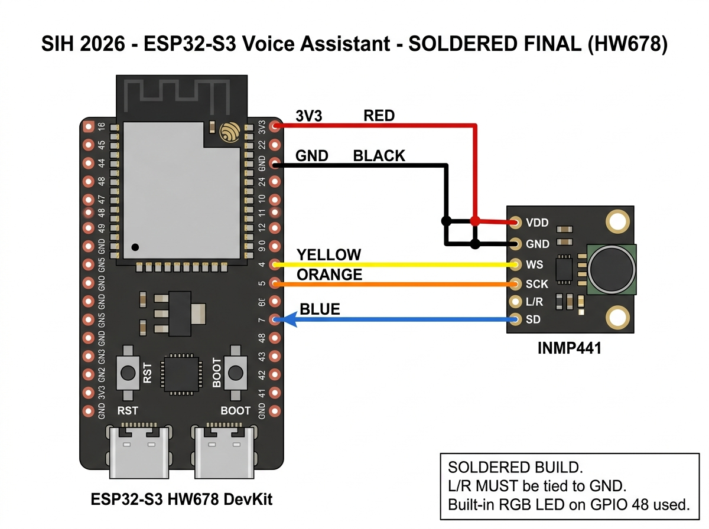

# 🔌 Circuit Design & Component Test Guide
### SIH 2026 — ESP32-S3 Voice Assistant | Rev 1.0
### Hardware Team — QuantumSIHCracker

> **Test every component BEFORE writing any firmware.**
> A wiring mistake found now saves hours of debugging later.

---

## 📐 Schematic — Final Soldered Build

> **Final Edition**: Designed for direct soldering. Breadboard issues eliminated. 



### Your Board: ESP32-S3 HW678 DevKit
- **Module**: ESP32-S3-WROOM (S-N13R8)
- **Left USB-C**: COM port → use this for programming and serial monitor
- **Right USB-C**: USB-OTG port → for USB device mode (not used in this project)
- **Built-in RGB LED**: visible on board, labeled "RGB" → controlled via GPIO 48 in code
- **RST button**: resets the board
- **BOOT button**: hold during power-on to enter flash mode if upload fails

---

## 🧰 Bill of Materials (BOM)

| # | Component | Specification | Qty | Purpose |
|---|---|---|---|---|
| 1 | ESP32-S3 Dev Module | Xtensa LX7 Dual Core, 8/16MB Flash, 8MB PSRAM | 1 | Main MCU — **has built-in WS2812B RGB LED on GPIO 48** |
| 2 | INMP441 MEMS Microphone | I2S, Omnidirectional, 3.3V, -26 dBFS sensitivity | 1 | Audio capture |
| 3 | Capacitor, 100nF (0.1µF) | Ceramic, any package | 1 | INMP441 VDD decoupling |
| 4 | Breadboard | Full size (830 tie points) | 1 | Prototyping |
| 5 | Jumper wires | Male-to-Male, assorted colours | 6 | Connections |
| 6 | USB-C cable | Data capable (not charge-only) | 1 | Programming + power |
| 7 | 5V USB power supply | ≥ 500mA | 1 | Board power (via USB) |

> ✅ **No external LED required.** The ESP32-S3 Dev Module has a **WS2812B RGB LED built in on GPIO 48**. No resistor needed either — the board handles it internally.
> ⚠️ **Critical**: Use a **data-capable** USB-C cable. Charge-only cables will not show up as a serial port.

---

## 🗺️ Complete Wiring Table

### Power Rail
| From | To | Wire Colour | Notes |
|---|---|---|---|
| ESP32-S3 `3V3` | INMP441 `VDD` | 🔴 Red | 3.3V only — never 5V |
| ESP32-S3 `GND` | INMP441 `GND` | ⚫ Black | Common ground |
| ESP32-S3 `GND` | INMP441 `L/R` | ⚫ Black | **Must be tied firmly to GND** (selects left channel) |
| INMP441 `VDD` | Cap+ (100nF) | — | Place cap as close to VDD pin as possible |
| Cap– (100nF) | INMP441 `GND` | — | Decoupling capacitor |

> ✅ **No LED wiring needed.** GPIO 48 is connected internally to the onboard WS2812B — just use it in code with `Adafruit_NeoPixel(1, 48, ...)`.

### I2S Signal Lines (INMP441 ↔ ESP32-S3)
| From | To | GPIO | Wire Colour | Function |
|---|---|---|---|---|
| ESP32-S3 `GPIO 4` | INMP441 `WS` | 4 | 🟡 Yellow | Word Select / LRCLK |
| ESP32-S3 `GPIO 5` | INMP441 `SCK` | 5 | 🟠 Orange | Bit Clock / BCLK |
| INMP441 `SD` | ESP32-S3 `GPIO 7` | 7 | 🔵 Blue | Serial Data (audio out) |

### LED Signal Line
> ✅ **No external wiring needed.** The WS2812B RGB LED is **built into the board** and internally connected to GPIO 48. Control it directly in code — no jumper wire required.

---

## 🔍 Pin Identification Guide

### ESP32-S3 Dev Module Pinout
```
         USB-C
    ┌──────────┐
3V3 │  1    30 │ 3V3
GND │  2    29 │ GND
IO1 │  3    28 │ IO1
IO2 │  4    27 │ IO2
IO4 │  5    26 │ IO4   ← WS  (yellow wire → INMP441 WS)
IO6 │  6    25 │ IO5   ← SCK (orange wire → INMP441 SCK)
IO5 │  7    24 │ IO7   ← SD  (blue wire ← INMP441 SD)
IO6 │  8    23 │ IO8
IO7 │  9    20 │ IO3
IO1 │ 10    21 │ IO1
IO9 │ 11    22 │ IO17
3V3 │ 12    19 │ IO48  ← WS2812B DIN (green wire → 330Ω → DIN)
    └──────────┘
         USB-C
         
Note: BOOT button = GPIO 0 (built-in)
Note: GPIO 48 = built-in RGB LED on most ESP32-S3 DevKit boards
```

### INMP441 Breakout Pinout
```
    ┌──────┐
    │ VDD  │ ← 3.3V (red)
    │ GND  │ ← GND (black)
    │ SD   │ → GPIO 7 (blue)
    │ SCK  │ ← GPIO 5 (orange)
    │ WS   │ ← GPIO 4 (yellow)
    │ L/R  │ ← GND (black) ← MUST be tied to GND
    └──────┘
```

---

## ✅ Component Test Checklist

Work through this **before writing any firmware**. Mark each item when done.

---

### ⚡ Test 1 — Power Verification (Software Only — no multimeter needed)

**Method**: Upload this sketch — it reads the 3.3V rail via ESP32's internal ADC and reports it over Serial

```cpp
// Test: Power rail verification — no multimeter needed
// Reads internal supply voltage and confirms USB serial works

void setup() {
    Serial.begin(115200);
    delay(1000);

    Serial.println("=== Power Verification Test ===");

    // Read internal reference voltage (approximates supply health)
    // ESP32-S3 has a built-in hall sensor / temperature sensor we can read
    uint32_t freeHeap = ESP.getFreeHeap();
    uint32_t chipId = (uint32_t)ESP.getEfuseMac();

    Serial.printf("✅ Serial communication:  WORKING\n");
    Serial.printf("✅ MCU running at:        %d MHz\n", ESP.getCpuFreqMHz());
    Serial.printf("✅ Free heap RAM:         %u bytes\n", freeHeap);
    Serial.printf("✅ Flash size:            %u MB\n", ESP.getFlashChipSize() / (1024*1024));
    Serial.printf("✅ Chip ID:               0x%08X\n", chipId);

    if (freeHeap > 100000) {
        Serial.println("\n✅ PASS — Power and MCU are healthy.");
        Serial.println("   Free heap > 100KB confirms 3.3V rail is stable.");
    } else {
        Serial.println("\n⚠️  Low heap — possible power issue. Check USB cable and port.");
    }

    // Blink built-in LED 5 times to visually confirm 3.3V on GPIO
    pinMode(2, OUTPUT);  // GPIO 2 = built-in LED on most boards
    for (int i = 0; i < 5; i++) {
        digitalWrite(2, HIGH); delay(200);
        digitalWrite(2, LOW);  delay(200);
    }
    Serial.println("   Built-in LED blinked 5× on GPIO 2 — confirms 3.3V GPIO rail OK.");
}

void loop() {}
```

- [ ] Upload succeeds (confirms USB cable is data-capable)
- [ ] Serial Monitor at **115200** baud shows `✅ PASS`
- [ ] Free heap shows > 100,000 bytes
- [ ] CPU frequency shows **240 MHz**
- [ ] Built-in LED (GPIO 2) blinks exactly 5 times then stops
- [ ] Check: INMP441 VDD wire is firmly connected to 3V3 pin (visual inspection)
- [ ] Check: All GND wires firmly connected (visual inspection)
- [ ] Check: INMP441 L/R pin tied to GND (visual inspection — this is the most forgotten wire)

**Pass criteria**: Serial shows PASS, heap > 100KB, LED blinks 5×, all wires visually confirmed

---

### 💡 Test 2 — WS2812B RGB LED

**Method**: Upload the LED blink sketch in Arduino IDE

```cpp
// Test: WS2812B LED on GPIO 48
// Upload this to confirm LED works
#include <Adafruit_NeoPixel.h>

#define LED_PIN 48
#define NUM_LEDS 1

Adafruit_NeoPixel strip(NUM_LEDS, LED_PIN, NEO_GRB + NEO_KHZ800);

void setup() {
    strip.begin();
    strip.show();
}

void loop() {
    strip.setPixelColor(0, strip.Color(255, 0, 0));   // RED
    strip.show(); delay(500);
    strip.setPixelColor(0, strip.Color(0, 255, 0));   // GREEN
    strip.show(); delay(500);
    strip.setPixelColor(0, strip.Color(0, 0, 255));   // BLUE
    strip.show(); delay(500);
    strip.setPixelColor(0, strip.Color(0, 0, 0));     // OFF
    strip.show(); delay(500);
}
```

**Arduino IDE settings for this test:**
- Board: `ESP32S3 Dev Module`
- USB CDC On Boot: `Enabled`
- Upload Speed: `921600`

- [ ] LED cycles RED → GREEN → BLUE → OFF repeatedly
- [ ] All three colours are clearly distinct (not just white)
- [ ] No flickering or unstable colour

**Pass criteria**: All 3 colours visible, smooth cycling

---

### 🎤 Test 3 — INMP441 Microphone (I2S Read)

**Method**: Upload this I2S test sketch

```cpp
// Test: INMP441 I2S microphone read
// Prints raw audio samples to Serial Monitor
#include <driver/i2s.h>

#define I2S_WS   4
#define I2S_SCK  5
#define I2S_SD   7

void setup() {
    Serial.begin(115200);
    while (!Serial);
    Serial.println("INMP441 I2S Test Starting...");

    // Configure I2S
    i2s_config_t i2s_config = {
        .mode = (i2s_mode_t)(I2S_MODE_MASTER | I2S_MODE_RX),
        .sample_rate = 16000,
        .bits_per_sample = I2S_BITS_PER_SAMPLE_32BIT,
        .channel_format = I2S_CHANNEL_FMT_ONLY_LEFT,
        .communication_format = I2S_COMM_FORMAT_STAND_I2S,
        .intr_alloc_flags = ESP_INTR_FLAG_LEVEL1,
        .dma_buf_count = 4,
        .dma_buf_len = 256,
        .use_apll = false,
        .tx_desc_auto_clear = false,
        .fixed_mclk = 0
    };

    i2s_pin_config_t pin_config = {
        .bck_io_num = I2S_SCK,
        .ws_io_num = I2S_WS,
        .data_out_num = I2S_PIN_NO_CHANGE,
        .data_in_num = I2S_SD
    };

    // Set pull-down on SD pin to avoid floating
    gpio_set_pull_mode((gpio_num_t)I2S_SD, GPIO_PULLDOWN_ONLY);

    i2s_driver_install(I2S_NUM_0, &i2s_config, 0, NULL);
    i2s_set_pin(I2S_NUM_0, &pin_config);

    Serial.println("I2S initialized. Reading samples...");
    Serial.println("SILENCE: values should be near 0");
    Serial.println("CLAP:    values should jump to +/- thousands");
}

void loop() {
    int32_t rawSamples[128];
    size_t bytesRead = 0;

    i2s_read(I2S_NUM_0, rawSamples, sizeof(rawSamples), &bytesRead, portMAX_DELAY);

    int samplesRead = bytesRead / sizeof(int32_t);
    int32_t peak = 0;

    for (int i = 0; i < samplesRead; i++) {
        int16_t sample = (int16_t)(rawSamples[i] >> 11); // scale to int16
        if (abs(sample) > abs(peak)) peak = sample;
    }

    Serial.printf("Peak amplitude: %6d  |  %s\n", peak,
        abs(peak) < 200   ? "SILENCE" :
        abs(peak) < 2000  ? "ambient noise" :
        abs(peak) < 10000 ? "SPEECH" : "LOUD / CLAP");

    delay(100);
}
```

**Expected Serial Monitor output:**
```
INMP441 I2S Test Starting...
I2S initialized. Reading samples...
SILENCE: values should be near 0
CLAP:    values should jump to +/- thousands

Peak amplitude:     42  |  SILENCE
Peak amplitude:     67  |  SILENCE
Peak amplitude:   2341  |  ambient noise   ← when talking
Peak amplitude:   8210  |  SPEECH          ← talking directly into mic
Peak amplitude:  18500  |  LOUD / CLAP     ← clap near mic
```

- [ ] Serial Monitor shows values near 0 in silence (< 200)
- [ ] Values jump when you talk (> 1000)
- [ ] Values jump sharply when you clap (> 10000)
- [ ] No value is constantly `0x7FFFFFFF` or `-32768` (floating line — check SD pull-down and wiring)
- [ ] No value is always exactly `0` (check VDD connection)

**Pass criteria**: Responsive to sound, noise floor < 200, speech > 1000

---

### 🔁 Test 4 — Serial Communication (921600 Baud)

**Method**: Upload and test at full project baud rate

```cpp
// Test: Serial at 921600 baud — confirms PC + cable can handle it
void setup() {
    Serial.begin(921600);
    delay(1000);
}

void loop() {
    Serial.println("BAUD_TEST_OK");
    delay(100);
}
```

- [ ] Open Serial Monitor at **921600** baud
- [ ] See `BAUD_TEST_OK` printing clearly every 100ms
- [ ] No garbled characters or question marks
- [ ] Confirmed on the actual cable you will use for the demo

**Pass criteria**: Clean output at 921600 baud on your demo cable

---

### 🌡️ Test 5 — System Stress (All Components Together)

**Method**: Run all three peripherals simultaneously for 5 minutes

```cpp
// Test: All components running together — check for heat, crashes, resets
#include <driver/i2s.h>
#include <Adafruit_NeoPixel.h>

#define I2S_WS 4
#define I2S_SCK 5
#define I2S_SD 7
#define LED_PIN 48

Adafruit_NeoPixel led(1, LED_PIN, NEO_GRB + NEO_KHZ800);

void setup() {
    Serial.begin(921600);
    led.begin(); led.show();

    gpio_set_pull_mode((gpio_num_t)I2S_SD, GPIO_PULLDOWN_ONLY);

    i2s_config_t cfg = {
        .mode = (i2s_mode_t)(I2S_MODE_MASTER | I2S_MODE_RX),
        .sample_rate = 16000,
        .bits_per_sample = I2S_BITS_PER_SAMPLE_32BIT,
        .channel_format = I2S_CHANNEL_FMT_ONLY_LEFT,
        .communication_format = I2S_COMM_FORMAT_STAND_I2S,
        .intr_alloc_flags = ESP_INTR_FLAG_LEVEL1,
        .dma_buf_count = 4, .dma_buf_len = 256
    };
    i2s_pin_config_t pins = {I2S_SCK, I2S_WS, I2S_PIN_NO_CHANGE, I2S_SD};
    i2s_driver_install(I2S_NUM_0, &cfg, 0, NULL);
    i2s_set_pin(I2S_NUM_0, &pins);

    Serial.println("Stress test running — check for resets...");
}

int ledColor = 0;
unsigned long lastLed = 0, lastPrint = 0;

void loop() {
    int32_t buf[256]; size_t br = 0;
    i2s_read(I2S_NUM_0, buf, sizeof(buf), &br, 10);

    int32_t peak = 0;
    for (int i = 0; i < (int)(br/4); i++)
        if (abs(buf[i] >> 11) > abs(peak)) peak = buf[i] >> 11;

    if (millis() - lastLed > 500) {
        lastLed = millis();
        ledColor = (ledColor + 1) % 3;
        led.setPixelColor(0, ledColor==0 ? led.Color(255,0,0) :
                             ledColor==1 ? led.Color(0,255,0) :
                                          led.Color(0,0,255));
        led.show();
    }

    if (millis() - lastPrint > 1000) {
        lastPrint = millis();
        Serial.printf("[%lus] Peak: %d | Free heap: %u bytes | Uptime OK\n",
                      millis()/1000, (int)peak, ESP.getFreeHeap());
    }
}
```

- [ ] Runs for **5 minutes** without spontaneous reset
- [ ] Free heap stays **stable** (not slowly decreasing — memory leak)
- [ ] LED cycling continues without freezing
- [ ] Audio peak responds to sound throughout
- [ ] ESP32-S3 chip does **not get hot to touch** (warm is fine, hot is not)

**Pass criteria**: 5-minute stable run, no resets, no heat issues

---

## 📊 Test Results Log

Fill this in as you complete each test. Keep this as your hardware validation record.

| Test | Date | Pass/Fail | Notes |
|---|---|---|---|
| Test 1 — Power & Continuity | | | |
| Test 2 — WS2812B LED | | | |
| Test 3 — INMP441 Microphone | | | |
| Test 4 — Serial @ 921600 | | | |
| Test 5 — Stress Test (5 min) | | | |

---

## ❌ Troubleshooting Guide

| Symptom | Most Likely Cause | Fix |
|---|---|---|
| Serial Monitor shows nothing | Wrong COM port or charge-only USB cable | Try different cable, check Device Manager |
| Peak always 0 | INMP441 VDD not connected, or no common GND | Check red and black wires |
| Peak always `32767` or `-32768` | SD pin floating | Add pull-down on GPIO 7, check SD wire |
| Peak never changes with sound | L/R pin not tied to GND | Connect INMP441 L/R → GND |
| LED is white instead of colours | Loose DIN wire | Reseat the wire on GPIO 48 |
| LED doesn't light at all | No GND or VCC, or wrong GPIO | Check wiring and confirm GPIO 48 |
| Upload fails | Wrong board settings or CDC not enabled | Set USB CDC On Boot = Enabled |
| Upload works but no serial output | Wrong baud rate in monitor | Set baud to 921600 |
| ESP32 resets randomly in stress test | Power supply can't handle load | Use powered USB hub or mains adapter |

---

## 📁 Files in This Folder

```
hardware-team/
├── HARDWARE_TEAM_PLAN.md       ← Full firmware build plan
├── CIRCUIT_DESIGN.md           ← This file (circuit + tests)
└── circuit_schematic_rev1.jpg  ← Schematic image Rev 1.0
```

> Once all 5 tests pass → move to `HARDWARE_TEAM_PLAN.md` Phase 1 firmware tasks.
